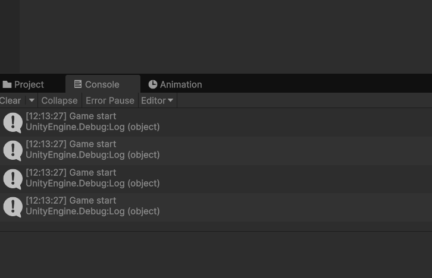
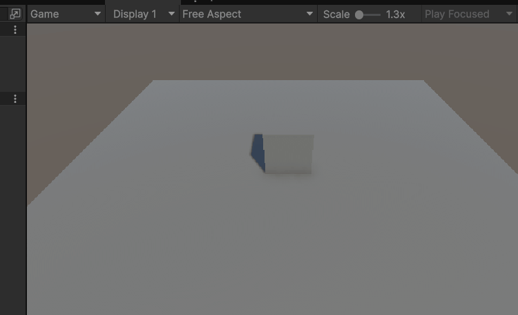
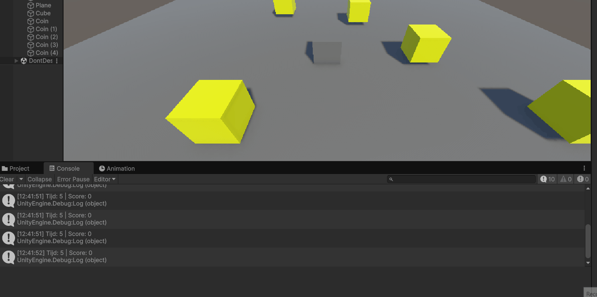
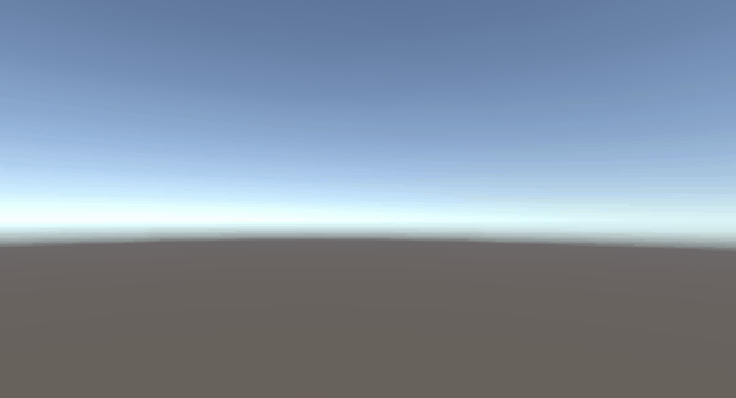
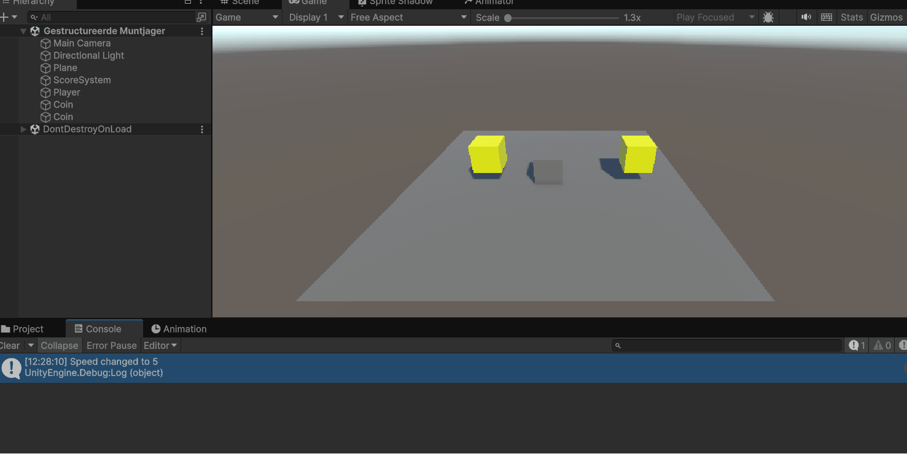
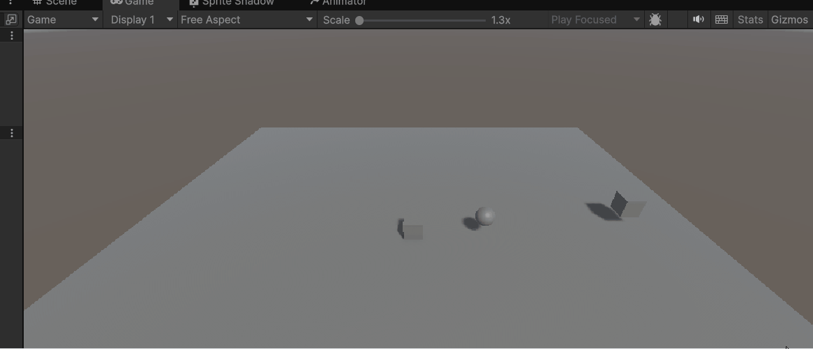

# lesson 1: Coin system

[Coin Script](https://github.com/Jonah-Robojoon/ProgtutM4/blob/main/Assets/scripts/PlayerScore.cs)

# lesson 2: Movement

[Movement Script](https://github.com/Jonah-Robojoon/ProgtutM4/blob/main/Assets/scripts/Jump.cs)

# lesson 3: MovementScore

[MovementScore Script](https://github.com/Jonah-Robojoon/ProgtutM4/blob/main/Assets/scripts/GameManager.cs)

# lesson 4: Scene Swich

SceneSwitchButton = Space

[GameManager Script](https://github.com/Jonah-Robojoon/ProgtutM4/blob/main/Assets/scripts/GameManager.cs)

[PlayerControl Script](https://github.com/Jonah-Robojoon/ProgtutM4/blob/main/Assets/scripts/PlayerControl.cs)

[SceneSwitch Script](https://github.com/Jonah-Robojoon/ProgtutM4/blob/main/Assets/scripts/SceneSwitcher.cs)

# lesson 5: Coin Manager

[ScoreManager Script](https://github.com/Jonah-Robojoon/ProgtutM4/blob/main/Assets/scripts/ScoreManager.cs)

[PlayerMove Script](https://github.com/Jonah-Robojoon/ProgtutM4/blob/main/Assets/scripts/PlayerMove.cs)

# lesson 6: lerps

[FollowAndReturn Script](https://github.com/Jonah-Robojoon/ProgtutM4/blob/main/Assets/scripts/FollowAndReturn.cs)

[Bullet Script](https://github.com/Jonah-Robojoon/ProgtutM4/blob/main/Assets/scripts/bulletScript.cs)

[BulletFire Script](https://github.com/Jonah-Robojoon/ProgtutM4/blob/main/Assets/scripts/BulletsFire.cs)
